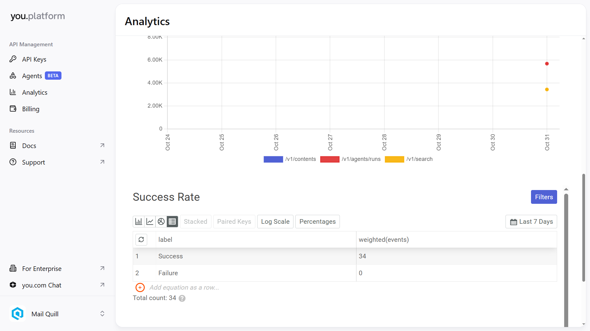

# ConvoGenius 🚀

[](https://nextjs.org/)
[](https://www.typescriptlang.org/)
[](https://getstream.io/)
[](https://openai.com/)
[](https://neon.tech/)
[](https://vercel.com/)


**Live Demo:** [https://hacksummit-22wy.vercel.app/](https://hacksummit-22wy.vercel.app/)

**Hackathon Submission:**  
This project is submitted to the **You.com Hackathon** under **Track 1: Enterprise-Grade Solutions**.  
It integrates **five You.com API endpoints**:
- `/v1/search` → Basic retrieval  
- `/v1/search?livecrawl=web` → Deep web content  
- `/v1/search?livecrawl=news` → News insights  
- `/v1/agents/runs` → Express Agent Q&A  
- `/v1/contents` → Page content extraction (MARKDOWN)  

These APIs form the **core of our RAG (Retrieval-Augmented Generation)** pipeline for real-time enterprise intelligence.  
All API usage is verifiable through You.com request logs.
## 📸 You.com API Usage Verification
<p align="center">
  
</p>

Above is the screenshot confirming verified requests made to the **You.com APIs** from ConvoGenius during runtime.

---

## 🎯 Executive Summary

**ConvoGenius** is an **AI-powered enterprise meeting intelligence platform** that blends **video conferencing**, **AI agents**, and **You.com search-powered RAG** to deliver smarter, more productive meetings.

By fusing **Stream Video SDK**, **OpenAI GPT-4**, and **You.com APIs**, ConvoGenius enables:
- Real-time transcription and AI summaries  
- External data retrieval via You.com for richer, context-aware insights  
- Automated analytics and follow-up action suggestions  

---

## 🏗️ System Architecture

```mermaid
graph TB
    subgraph "Client Layer"
        Web[Next.js Web App]
        Mobile[Mobile Responsive]
    end

    subgraph "API Gateway"
        tRPC[tRPC API Layer]
        Auth[Better Auth]
    end

    subgraph "Core Services"
        Video[Stream Video SDK]
        Chat[Stream Chat SDK]
        AI[OpenAI GPT-4]
        Transcription[Real-time Transcription]

        subgraph "You.com API Layer"
            YouSearch[/v1/search - Basic Search/]
            YouWeb[/v1/search?livecrawl=web - Web Crawl/]
            YouNews[/v1/search?livecrawl=news - News Crawl/]
            YouAgent[/v1/agents/runs - Express Agent/]
            YouContent[/v1/contents - Content Extraction/]
        end
    end

    subgraph "Data Layer"
        DB[(PostgreSQL/Neon)]
        Storage[File Storage]
    end

    subgraph "External Integrations"
        Webhook[Inngest Webhooks]
        Analytics[Meeting Analytics]
    end

    Web --> tRPC
    Mobile --> tRPC
    tRPC --> Auth
    tRPC --> Video
    tRPC --> Chat
    tRPC --> AI
    tRPC --> DB
    AI --> YouSearch
    AI --> YouWeb
    AI --> YouNews
    AI --> YouAgent
    AI --> YouContent
    Video --> Transcription
    AI --> Webhook
    Webhook --> Analytics
````

---

## 🤖 You.com Integration (RAG Pipeline)

| Endpoint                    | Purpose                       | Integration                 |
| --------------------------- | ----------------------------- | --------------------------- |
| `/v1/search`                | Quick factual retrieval       | Used during meeting queries |
| `/v1/search?livecrawl=web`  | Deep web context for insights | Used in agent follow-ups    |
| `/v1/search?livecrawl=news` | Latest news and trends        | Powers current context      |
| `/v1/agents/runs`           | Express Agent responses       | For enterprise Q&A          |
| `/v1/contents`              | Page-level extraction         | For document summarization  |

Agents use these endpoints dynamically to **retrieve, filter, and inject knowledge** into GPT-4 prompts for summaries, insights, and post-meeting recommendations.

---

## 💡 Core Features

* 🧠 **RAG-Powered AI Agents** – Augmented by You.com for external, real-time knowledge.
* 🎙️ **Real-time Transcription** – Automatic speech-to-text and sentiment tracking.
* 📊 **Meeting Analytics Dashboard** – Participation and topic insights.
* 🔒 **Secure Auth & Sessions** – Powered by BetterAuth and JWT.
* 📹 **Video + Chat** – Using Stream SDKs for low-latency communication.
* ⚙️ **Automated Summaries** – AI-generated summaries infused with You.com search results.

---

## 🛠️ Tech Stack

**Frontend:** Next.js, TypeScript, Tailwind CSS, Framer Motion
**Backend:** tRPC, Drizzle ORM, BetterAuth
**Database:** Neon (PostgreSQL)
**AI:** OpenAI GPT-4, You.com APIs
**Video/Chat:** Stream Video + Chat SDK
**Hosting:** Vercel
**Jobs:** Inngest

---

## 🚀 Deployment

**Production URL:**
🔗 [https://hacksummit-22wy.vercel.app/](https://hacksummit-22wy.vercel.app/)

**Required Env Vars:**

```
YOU_API_KEY=
OPENAI_API_KEY=
STREAM_API_KEY=
STREAM_API_SECRET=
DATABASE_URL=
NEXT_PUBLIC_SITE_URL=
```

---

## 🧩 RAG Flow Example

```typescript
// lib/you-search.ts
export async function searchWithYou(query: string) {
  const res = await fetch("https://api.you.com/v1/search", {
    method: "POST",
    headers: {
      "Authorization": `Bearer ${process.env.YOU_API_KEY}`,
      "Content-Type": "application/json",
    },
    body: JSON.stringify({ q: query, num_web_results: 5 }),
  });
  const data = await res.json();
  return data.results?.map(r => r.snippet).join("\n");
}
```

This function feeds retrieved snippets into the **AI prompt** for context-aware generation:

```typescript
const youResults = await searchWithYou(userQuery);
const aiResponse = await openai.chat.completions.create({
  model: "gpt-4-turbo",
  messages: [
    { role: "system", content: "Use the provided search results for context." },
    { role: "user", content: `${userQuery}\n\nSearch context:\n${youResults}` }
  ]
});
```

---

## 📊 Analytics Overview

* **Speaker analytics**
* **Engagement scoring**
* **Topic clusters**
* **Decision tracking**

Backed by **Inngest background jobs** and **Neon analytics tables**.

---

## 🔐 Security

* AES-256 encrypted data
* TLS 1.3 in transit
* Secure JWT sessions
* SOC2-ready practices
* OAuth2 providers (Google, GitHub)

---

## 🧱 Project Structure

```
src/
├── app/             # Next.js routes
├── modules/         # Features: auth, agents, meetings
├── lib/             # You.com + AI + utils
├── trpc/            # tRPC routers
├── db/              # Drizzle schemas
└── inngest/         # Background jobs
```

---

## 📄 License

Licensed under the **MIT License**.

---

## 🏆 Acknowledgments

* **You.com** – Search APIs powering RAG
* **OpenAI** – GPT-4 for reasoning and summaries
* **Stream** – Video + Chat SDKs
* **Neon** – Scalable PostgreSQL
* **Vercel** – Deployment infrastructure

---

## 🙌 Author

**👨‍💻 Chuks David Patrick**
[@Twitter](https://x.com/david_patrick01)
[GitHub](https://github.com/David-patrick-chuks)


---
