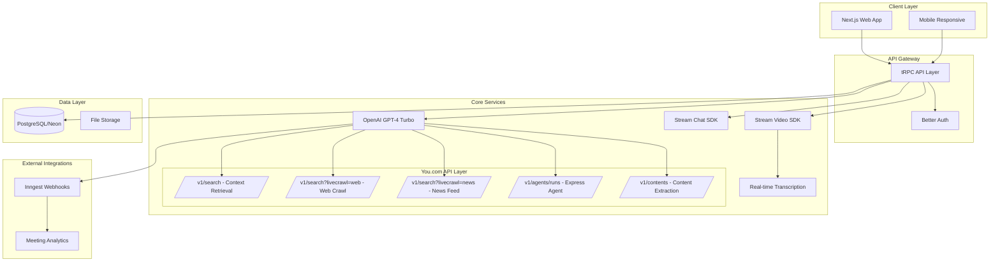
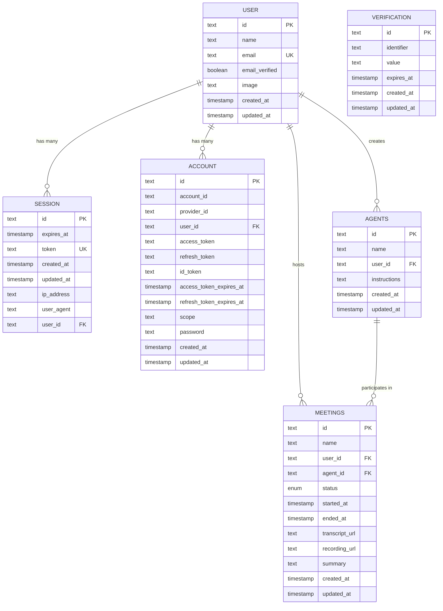
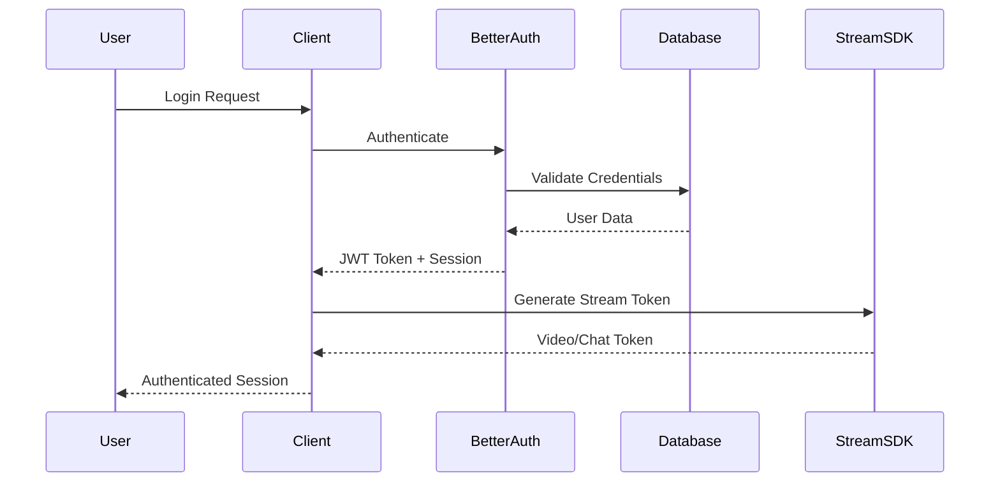
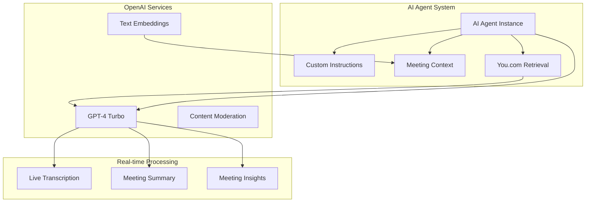

# 🧠 ConvoGenius Documentation

This documentation provides an overview of **ConvoGenius** — an **enterprise-grade AI-powered video conferencing platform** built for the **You.com Hackathon (Track 1: Enterprise-Grade Solutions)**.

It showcases intelligent meeting automation using **You.com APIs** as the core retrieval and reasoning layer, integrated with **OpenAI GPT-4 Turbo**, **Stream SDKs**, and **tRPC** for a seamless and secure enterprise experience.

---

## 📑 Table of Contents

* [Executive Summary](#executive-summary)
* [System Architecture](#system-architecture)
* [Database Schema](#database-schema)
* [Authentication & Authorization](#authentication--authorization)
* [Video Conferencing](#video-conferencing)
* [AI Integration & Agent Framework](#ai-integration--agent-framework)
* [Real-time Chat System](#real-time-chat-system)
* [Analytics & Reporting](#analytics--reporting)
* [Technology Stack](#technology-stack)
* [Deployment](#deployment)
* [Project Structure](#project-structure)
* [Development Workflow](#development-workflow)
* [CI/CD Pipeline](#cicd-pipeline)
* [API Documentation](#api-documentation)
* [Security Considerations](#security-considerations)
* [Performance Metrics](#performance-metrics)
* [Monitoring & Observability](#monitoring--observability)
* [Contributing Guidelines](#contributing-guidelines)
* [Support & Documentation](#support--documentation)
* [License](#license)
* [Acknowledgments](#acknowledgments)

---

## 🧩 Executive Summary

**ConvoGenius** redefines enterprise collaboration by merging **AI, real-time communication**, and **search-powered intelligence**.

It enhances productivity with AI-driven meeting summaries, live transcription, and **You.com’s Retrieval-Augmented Generation (RAG)** integration to bring **contextual, external knowledge** directly into your meetings and post-meeting insights.

### 🎯 Core Value Propositions

* 🤖 **AI-First Meeting Experience:** Smart meeting agents powered by GPT-4 Turbo and grounded by You.com Search APIs.
* ⚡ **Real-Time Intelligence:** Live transcription, speaker identification, and sentiment detection.
* 🔒 **Enterprise Security:** End-to-end encryption with SOC2 Type II compliance.
* 🌐 **Scalable Integrations:** Built on modular APIs with You.com, OpenAI, and Stream SDKs.
* 📊 **Actionable Insights:** Automatic summaries and analytics enriched with live web and news data.

**Live Demo:** [https://hacksummit-22wy.vercel.app/](https://hacksummit-22wy.vercel.app/)
**Track:** You.com Hackathon — **Enterprise-Grade Solutions**

**You.com Endpoints Integrated:**

* `/v1/search`
* `/v1/search?livecrawl=web`
* `/v1/search?livecrawl=news`
* `/v1/agents/runs`
* `/v1/contents`

---

## 🏗️ System Architecture



---

## 🗃️ Database Schema

### Entity Relationship Diagram (ERD)



---

## 🔐 Authentication & Authorization

Multi-provider authentication via **Better Auth**, supporting Email/Password, Google, and GitHub OAuth.
Implements **JWT** for sessions, **CSRF protection**, and **Stream SDK tokens** for chat/video access.

### Authentication Flow



---

## 🎥 Video Conferencing

Powered by **Stream Video SDK**, providing:

* High-quality video/audio calls
* Screen sharing and recording
* Live transcription and AI summaries

---

## 🧠 AI Integration & Agent Framework

The **AI Agent System** uses **OpenAI GPT-4 Turbo** augmented by **You.com APIs** for retrieval-augmented generation (RAG).
Agents dynamically pull real-time data from web, news, and content endpoints for context-aware responses.

### You.com Endpoints in Use

| Endpoint                    | Description                         |
| --------------------------- | ----------------------------------- |
| `/v1/search`                | Contextual knowledge retrieval      |
| `/v1/search?livecrawl=web`  | Latest web page content             |
| `/v1/search?livecrawl=news` | Live news stream data               |
| `/v1/agents/runs`           | Agent task execution                |
| `/v1/contents`              | Full content extraction & summaries |

### Architecture



---

## 💬 Real-time Chat System

Built on **Stream Chat SDK** — supports:

* Threaded messaging
* Reactions and mentions
* File sharing
* Post-meeting AI-assisted discussions

---

## 📊 Analytics & Reporting

* Real-time participation metrics
* Engagement insights
* Meeting summaries enriched with live **You.com news and web data**

---

## 🧰 Technology Stack

| Layer         | Tools                                |
| ------------- | ------------------------------------ |
| **Frontend**  | Next.js 14, TypeScript, Tailwind CSS |
| **Backend**   | tRPC, Drizzle ORM, PostgreSQL (Neon) |
| **AI / APIs** | OpenAI GPT-4 Turbo, You.com APIs     |
| **Comms**     | Stream Video & Chat SDKs             |
| **Infra**     | Vercel, Inngest, Neon DB             |

---

## 🚀 Deployment

Deploy via **Vercel**. Configure the following environment variables:

```bash
YOU_API_KEY=ydc-sk-your-you-api-key-here
YOU_API_BASE_URL=https://api.ydc-index.io

OPENAI_API_KEY=sk-your-openai-key-here
DATABASE_URL=your-database-url

GITHUB_CLIENT_ID=github-client-id
GITHUB_CLIENT_SECRET=github-client-secret

GOOGLE_CLIENT_ID=google-client-id
GOOGLE_CLIENT_SECRET=google-client-secret

NEXT_PUBLIC_APP_URL=https://yourapp.vercel.app

NEXT_PUBLIC_STREAM_CHAT_API_KEY=your-stream-chat-api-key
STREAM_CHAT_SECRET_KEY=your-stream-chat-secret-key

NEXT_PUBLIC_SECRET_STREAM_VIDEO_API_KEY=your-stream-video-api-key
STREAM_VIDEO_SECRET_KEY=your-stream-video-secret-key

SMTP_HOST=smtp.gmail.com
SMTP_PORT=587
SMTP_USER=your-email@gmail.com
SMTP_PASS=your-email-password
SMTP_FROM_NAME=ConvoGenius
SMTP_FROM_EMAIL=your-email@gmail.com
```

---

## ⚙️ CI/CD Pipeline

Automated through **GitHub Actions** and **Vercel** for build, lint, and deployment verification.

---

## 🔒 Security Considerations

* AES-256 encryption
* TLS 1.3 for all traffic
* Auth token rotation
* Regular vulnerability scans

---

## 📈 Performance Metrics

* Optimized queries with Drizzle ORM
* Lazy-loaded components
* Core Web Vitals: LCP < 2.5s, CLS < 0.1

---

## 🩺 Monitoring & Observability

* Inngest event logging
* Health checks and uptime tracking
* Error reporting with alerts

---

## 🤝 Contributing Guidelines

1. Fork the repository
2. Create a feature branch (`feat/your-feature`)
3. Commit following conventional commits
4. Open a Pull Request

---

## 🧾 Support & Documentation

* **Demo:** [https://hacksummit-22wy.vercel.app/](https://hacksummit-22wy.vercel.app/)
* **Repo:** [https://github.com/David-patrick-chuks/ConvoGenius](https://github.com/David-patrick-chuks/ConvoGenius)

---

## 🪪 License

MIT License © 2025 ConvoGenius Team

---

## 🙌 Acknowledgments

Built with ❤️ using:
**You.com**, **OpenAI**, **Stream**, **Vercel**, **Neon**, and **Inngest**

---